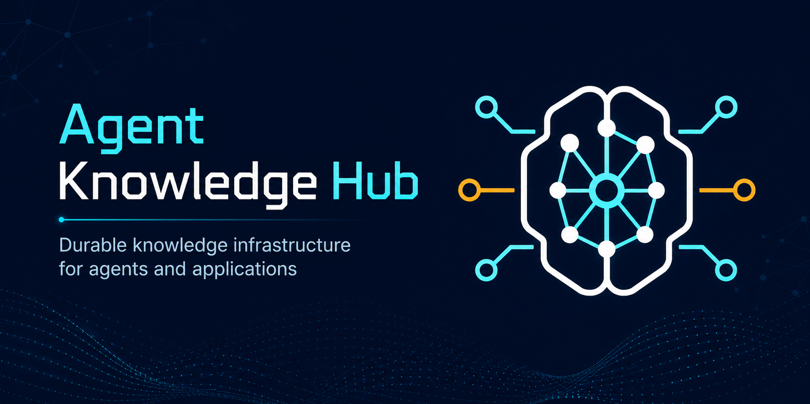
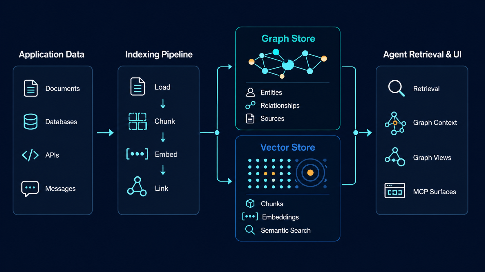
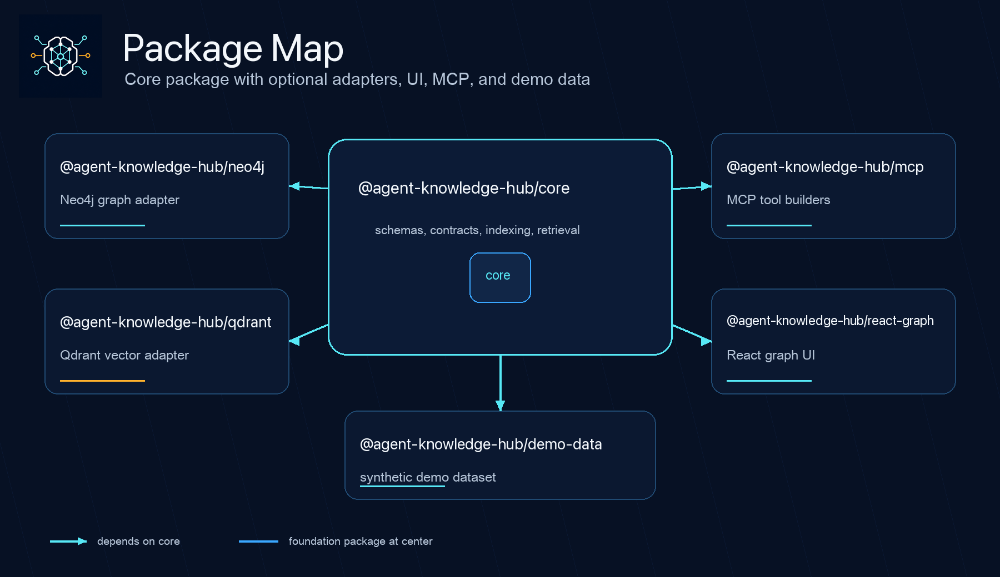
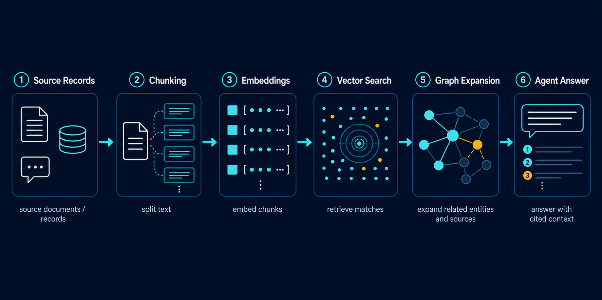

# Agent Knowledge Hub



Agent Knowledge Hub is a TypeScript toolkit for building durable knowledge
infrastructure for agents and applications. It combines:

- a graph model for entities, facts, activities, and provenance
- a vector index for semantic retrieval over chunks
- indexing and retrieval primitives that stay database-independent
- MCP helpers for exposing knowledge to agent tools
- React graph components for inspection and operations interfaces

It is intentionally generic. The repository does not ship private data,
application-specific taxonomy, or operational business logic.

## Why It Exists

Many agent-enabled products eventually need the same layer:

- durable, source-backed knowledge records
- semantic retrieval with relationship context
- consistent indexing and backfill flows
- reusable graph views for people and agents
- one source of truth shared across APIs, UIs, and automations

Without that layer, teams usually end up with stale documents, duplicated facts,
vector search without relationships, or graph data that is disconnected from
retrieval.

## What You Get



- `@agent-knowledge-hub/core`
  Database-independent schemas, contracts, indexing, chunking, and retrieval
- `@agent-knowledge-hub/neo4j`
  Neo4j implementation of the graph-store contract
- `@agent-knowledge-hub/qdrant`
  Qdrant implementation of the vector-store contract
- `@agent-knowledge-hub/mcp`
  MCP tool builders for retrieval-oriented agent surfaces
- `@agent-knowledge-hub/react-graph`
  React graph components built with Sigma.js and Graphology
- `@agent-knowledge-hub/demo-data`
  Synthetic demo graph for local validation and UI smoke testing



## Good Fit

Use Agent Knowledge Hub if you are building:

- AI products with durable memory
- internal tools that need shared knowledge across agents and humans
- GraphRAG or source-backed retrieval systems
- entity-centric applications with graph relationships
- applications that want reusable indexing and retrieval infrastructure

## Quick Start

### Install from a local checkout

```sh
pnpm install
pnpm build
pnpm test
```

### Install packages in an application

Install only what you need:

```sh
pnpm add @agent-knowledge-hub/core
pnpm add @agent-knowledge-hub/neo4j @agent-knowledge-hub/qdrant
pnpm add @agent-knowledge-hub/mcp
pnpm add @agent-knowledge-hub/react-graph
```

### Run the local demo runtime

```sh
pnpm db:up
pnpm db:seed
pnpm build
pnpm test
```

Local services:

- Neo4j Browser: <http://localhost:7474>
- Qdrant dashboard: <http://localhost:6333/dashboard>

### Minimal usage shape

```ts
import { DefaultKnowledgeIndexer } from "@agent-knowledge-hub/core";
import { Neo4jGraphStore } from "@agent-knowledge-hub/neo4j";
import { QdrantVectorStore } from "@agent-knowledge-hub/qdrant";

const graphStore = new Neo4jGraphStore({
  uri: "bolt://127.0.0.1:7687",
  username: "neo4j",
  password: "change-me",
});

const vectorStore = new QdrantVectorStore({
  url: "http://127.0.0.1:6333",
  collection: "agent_knowledge_hub",
  dimensions: 1536,
});

const indexer = new DefaultKnowledgeIndexer({
  graphStore,
  vectorStore,
  embedText: async (text) => embed(text),
});
```

Typical flow:

1. Upsert durable knowledge nodes, source references, and edges into the graph store.
2. Chunk text and generate embeddings with a host-provided embedding function.
3. Upsert chunk vectors into the vector store.
4. Retrieve semantically and expand graph neighbors for cited context.



## Runtime Model

- Graph store: canonical nodes, edges, entities, activities, and sources
- Vector store: chunk embeddings and retrieval payloads
- Application database: operational records, transient state, scheduling, and app-specific state

The core API stays database-independent. Neo4j and Qdrant are optional adapters,
not hard dependencies of the core package.

## Documentation

- [Architecture](./docs/architecture.md)
- [Technical Specification](./docs/technical-specification.md)
- [Host App Integration](./docs/host-app-integration.md)
- [Migration Plan](./docs/migration-plan.md)
- [Local Runtime](./docs/local-runtime.md)
- [VPS Deployment](./docs/vps-deployment.md)

## Current State

- package contracts: ready
- graph and vector adapters: ready
- React graph UI: ready
- demo dataset: ready
- local runtime flow: ready
- integration and migration docs: ready

## Non-Goals

- job orchestration or task execution state
- transient logs, run history, or scheduler state
- application-specific taxonomy baked into package contracts
- embedded personal or proprietary data

## Community Files

- [LICENSE](./LICENSE)
- [CONTRIBUTING.md](./CONTRIBUTING.md)
- [CODE_OF_CONDUCT.md](./CODE_OF_CONDUCT.md)
- [SECURITY.md](./SECURITY.md)
