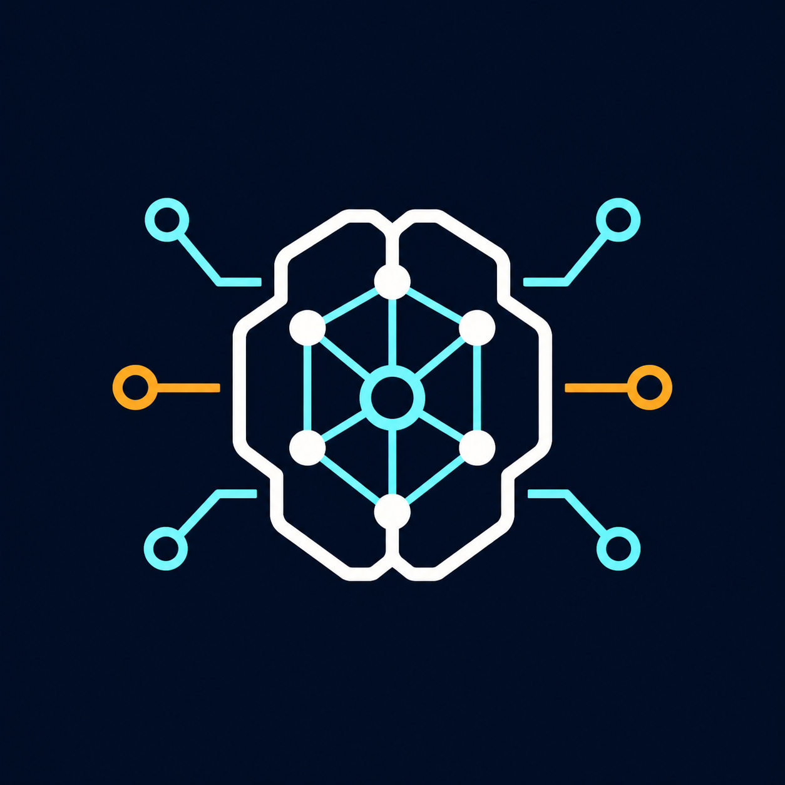
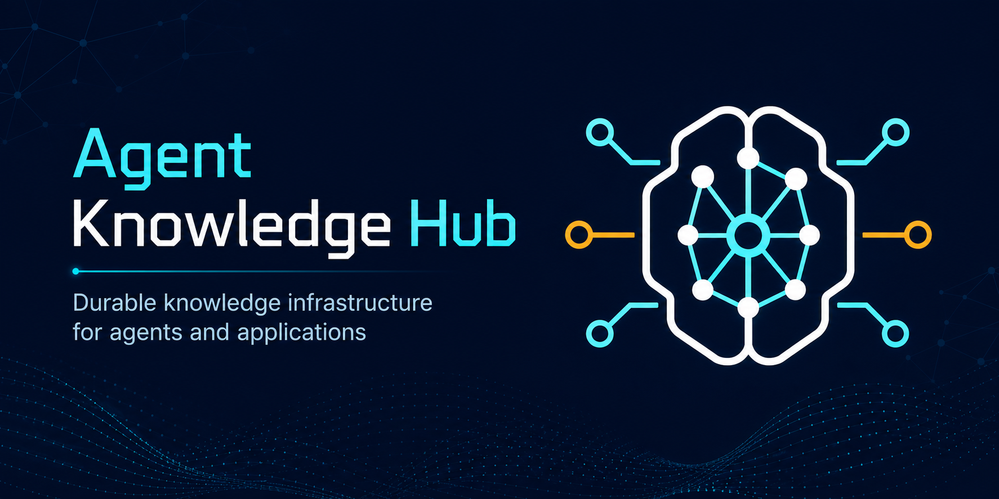
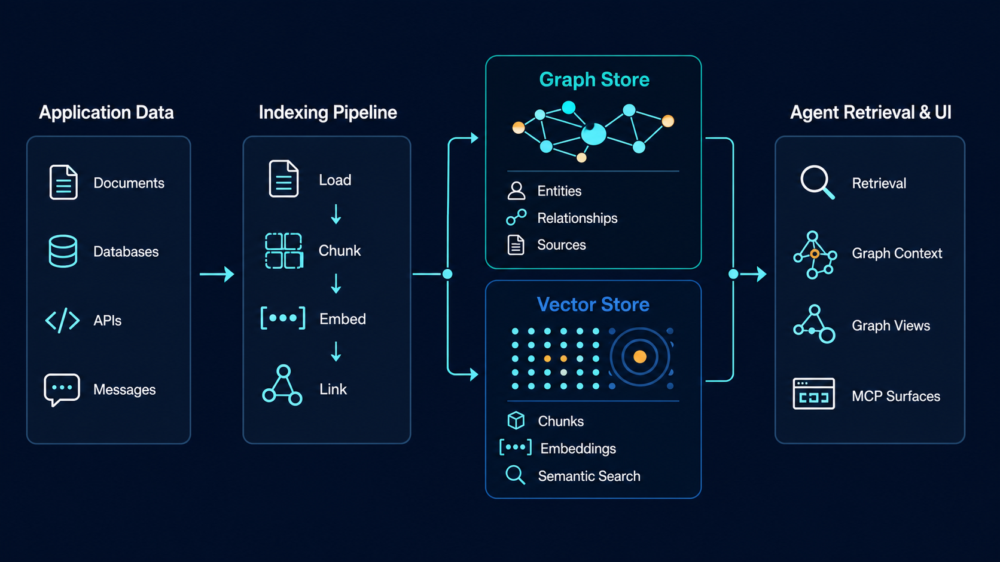
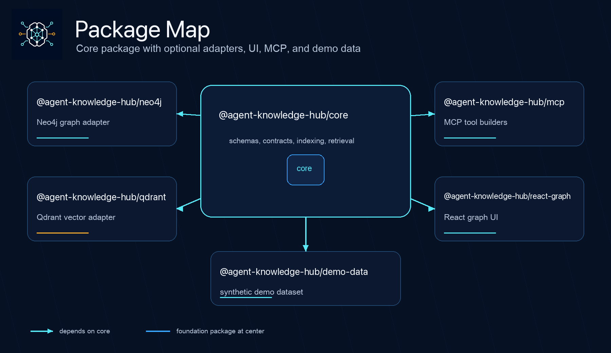
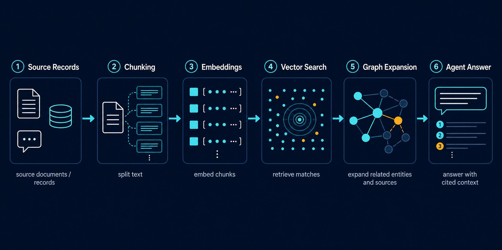

<h1>
  
  Agent Knowledge Hub
</h1>



Agent Knowledge Hub is a TypeScript toolkit for durable, source-backed agent knowledge. Applications own their data, identity, authorization, and deployment model; this repository supplies reusable contracts and optional building blocks.

## Package model

`core contracts → optional graph/vector adapters → optional MCP tools → optional React graph UI`



- `@agent-knowledge-hub/core` depends only on Zod. It defines portable `GraphStore`, `VectorStore`, embedding, indexing, and retrieval contracts.
- `@agent-knowledge-hub/neo4j` and `@agent-knowledge-hub/qdrant` are optional reference adapters, not required infrastructure. Implement the core interfaces to use another graph database, vector database, relational store, or hosted retrieval provider.
- `@agent-knowledge-hub/mcp` is adapter-independent. It receives a `GraphStore` and `KnowledgeRetriever`, so it works with the reference adapters or custom implementations.
- `@agent-knowledge-hub/react-graph` is optional inspection UI. It exports `KnowledgeGraphView` and `EntityGraphView`.

The repository ships no private data, application taxonomy, credentials, or operational business logic.

## What is included



Six packages are available: `core`, optional `neo4j`, optional `qdrant`, optional `mcp`, optional `react-graph`, and synthetic `demo-data`. The graph UI has two public React components, reusable internal top-bar, legend, and sidebar components, plus one internal action button.

## MCP tools

The portable MCP surface is read-only. A host application owns HTTP transport, credentials, tenancy, authorization, and any write operations.

| Tool | Purpose |
| --- | --- |
| `knowledge_retrieve` | Semantic retrieval with optional graph expansion and citations. |
| `knowledge_graph_neighborhood` | Bounded neighborhood around a known node. |
| `knowledge_list_nodes` | Bounded graph discovery. |

Hosts may append their own documented tools without changing the portable catalog. No database-specific MCP API is required.

## Source-first quick start

This is a source-first `0.1.0` release. Clone the repository and use it from a workspace or checked-out package path; package names are not yet published to npm.

```sh
git clone https://github.com/gauravsaxena1997/agent-knowledge-hub.git
cd agent-knowledge-hub
pnpm install --frozen-lockfile
pnpm build
pnpm test
```

For a host application in the same workspace, install only the package paths it needs. This keeps source-based consumers pinned to a reviewed Git revision until npm publishing is introduced later.

## Synthetic demo

The repository includes a runnable in-memory demo with synthetic Atlas Cloud product, team, customer, and support records. It does not connect to SignalLedger, any SignalLedger database, or any external service.

```sh
pnpm --filter agent-knowledge-hub-basic-example start
```

For the local Neo4j and Qdrant demo runtime:

```sh
pnpm db:up
pnpm db:seed
```

The default local services bind to `127.0.0.1` only. See [Local Runtime](./docs/local-runtime.md) before running them.

## Real-world reference

[SignalLedger live demo](https://sales-knowledge-rag.gauravsaxena.site) is a separate public application built with Agent Knowledge Hub concepts and packages. Its deployed data, runtime, and source code are not included here.



## Documentation

- [Architecture](./docs/architecture.md)
- [Technical Specification](./docs/technical-specification.md)
- [Host App Integration](./docs/host-app-integration.md)
- [Migration Guide](./docs/migration-plan.md)
- [Local Runtime](./docs/local-runtime.md)
- [Deployment Guide](./docs/vps-deployment.md)
- [Release Process](./docs/release-process.md)

## Project status

The contracts, reference adapters, MCP catalog, graph UI, and synthetic demo are actively maintained. This repository is ready for source-based evaluation; a public npm release follows only after the documented release checks and compatibility gates pass.

## Contributing

Contributors fork this repository, create a feature branch in their fork, and open a pull request to `main`. Only repository maintainers can merge pull requests or push to protected branches. See [CONTRIBUTING.md](./CONTRIBUTING.md).

## Community and security

- [LICENSE](./LICENSE)
- [CONTRIBUTING.md](./CONTRIBUTING.md)
- [CODE_OF_CONDUCT.md](./CODE_OF_CONDUCT.md)
- [SECURITY.md](./SECURITY.md)
- [Security exceptions](./docs/security-exceptions.md)
